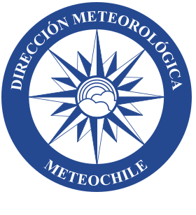
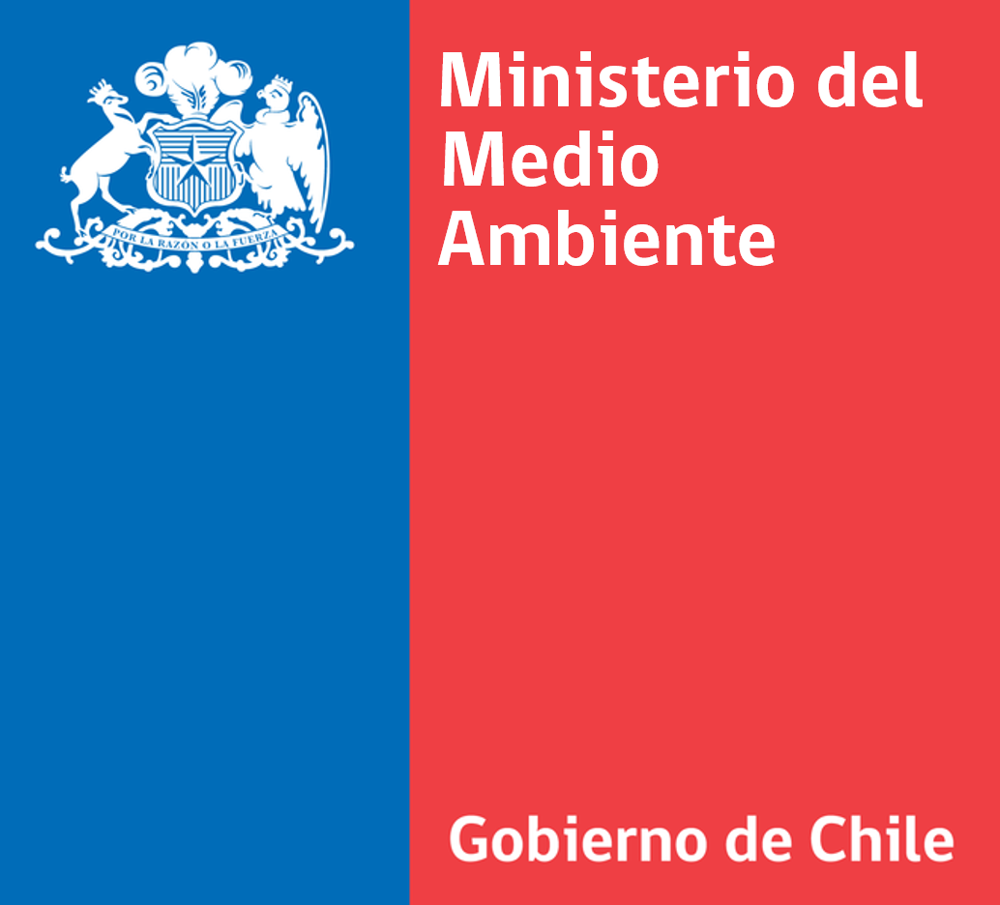
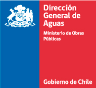

# Datos Cambio Climatico

    

El objetivo del Observatorio de Cambio Climático, liderado por el Ministerio de Ciencia, Tecnología, Conocimiento e Innovación es un proyecto que tiene como objetivo disponer de información de interés climatologico recopilada por instituciones a lo largo del pais con tal de habilitar información que contribuya a la toma de decisiones de las autoridades y la ciudadanía

Ver http://occ.minciencia.gob.cl/ para más información.

# Data Products

- [agua24_dmc - Agua caída últimas 24 horas - Dirección Metereológica de Chile](output/agua24_dmc) 
- [agua6_dmc - Agua caída últimas 6 horas - Dirección Metereológica de Chile](output/agua6_dmc) 
- [co_sinca - CO en el aire - Servicio Nacional de Calidad del Aire](output/co_sinca) 
- [direccion_viento_ceaza - Dirección del viento - Centro de Estudios Avanzados en Zonas Áridas (CEAZA)](output/direccion_viento_ceaza) 
- [evotranspiracion_ceaza - Evotranspiración - Centro de Estudios Avanzados en Zonas Áridas (CEAZA)](output/evotranspiracion_ceaza) 
- [humedad_dmc - Humedad relativa - Dirección Metereológica de Chile](output/humedad_dmc) 
- [humedad_sinca - Humedad relativa - Servicio Nacional de Calidad del Aire](output/humedad_sinca) 
- [mpm10_sinca - MPM10 en el aire - Servicio Nacional de Calidad del Aire](output/mpm10_sinca) 
- [mpm25_sinca - MPM20 en el aire - Servicio Nacional de Calidad del Aire](output/mpm25_sinca) 
- [no2_sinca - NO2 en el aire - Servicio Nacional de Calidad del Aire](output/no2_sinca) 
- [o3_sinca - O3 en el aire - Servicio Nacional de Calidad del Aire](output/o3_sinca) 
- [precipitacion_ceaza - Precipitaciones - Centro de Estudios Avanzados en Zonas Áridas (CEAZA)](output/precipitacion_ceaza) 
- [precipitaciones_sinca - Precipitaciones - Servicio Nacional de Calidad del Aire](output/precipitaciones_sinca) 
- [precipitaciones_sinca - Presión - Servicio Nacional de Calidad del Aire](output/precipitaciones_sinca) 
- [presionqfe_dmc - Presión QFE - Dirección Metereológica de Chile](output/presionqfe_dmc) 
- [presionqff_dmc - Presión QFE - Dirección Metereológica de Chile](output/presionqff_dmc) 
- [pto_rocio_ceaza - Temperatura de Rocío - Centro de Estudios Avanzados en Zonas Áridas (CEAZA)](output/pto_rocio_ceaza) 
- [radiacion_ceaza - Radiación - Centro de Estudios Avanzados en Zonas Áridas (CEAZA)](output/radiacion_ceaza) 
- [rocio_dmc - Temperatura de Rocío - Dirección Metereológica de Chile](output/rocio_dmc) 
- [so2_sinca - SO2 en el aire - Servicio Nacional de Calidad del Aire](output/so2_sinca) 
- [temperatura_aire_ceaza - Temperatura del aire - Centro de Estudios Avanzados en Zonas Áridas (CEAZA)](output/temperatura_aire_ceaza) 
- [temperatura_dmc - Temperatura - Dirección Metereológica de Chile](output/temperatura_dmc) 
- [temperatura_suelo_ceaza - Temperatura de suelo - Centro de Estudios Avanzados en Zonas Áridas (CEAZA)](output/temperatura_suelo_ceaza) 
- [tmaxima_dmc - Temperaturas máximas - Dirección Metereológica de Chile](output/tmaxima_dmc) 
- [tminima_dmc - Temperaturas mínimas - Dirección Metereológica de Chile](output/tminima_dmc) 
- [velocidad_viento_ceaza - Velocidad del viento - Centro de Estudios Avanzados en Zonas Áridas (CEAZA)](output/velocidad_viento_ceaza) 
- [viento_dmc - Velocidad del viento - Dirección Metereológica de Chile](output/viento_dmc) 

# Instituciones
El Observatorio de Cambio Climático cuenta con la participación y colaboración de las siguientes instituciones:
| Institución  | Data products |
| :-------------: | ------------- |
|   |    |
| | [agua24_dmc](output/agua24_dmc) - [agua6_dmc](output/agua6_dmc) - [humedad_dmc](output/humedad_dmc) - [presionqfe_dmc](output/presionqfe_dmc) - [presionqff_dmc](output/presionqff_dmc) - [rocio_dmc](output/rocio_dmc) - [temperatura_dmc](output/temperatura_dmc) - [tmaxima_dmc](output/tmaxima_dmc) - [tminima_dmc](output/tminima_dmc) - [viento_dmc](output/viento_dmc) |
|  | [humedad_sinca](output/humedad_sinca) - [mpm10_sinca](output/mpm10_sinca) - [mpm25_sinca](output/mpm25_sinca) - [no2_sinca](output/no2_sinca) - [o3_sinca ](output/o3_sinca) - [precipitaciones_sinca](output/precipitaciones_sinca) - [precipitaciones_sinca](output/precipitaciones_sinca) - [so2_sinca](output/so2_sinca)   |
|  | [direccion_viento_ceaza](output/direccion_viento_ceaza) - [evotranspiracion_ceaza](output/evotranspiracion_ceaza) - [precipitacion_ceaza](output/precipitacion_ceaza) - [pto_rocio_ceaza](output/pto_rocio_ceaza) - [radiacion_ceaza](output/radiacion_ceaza) - [temperatura_aire_ceaza](output/temperatura_aire_ceaza) - [temperatura_suelo_ceaza](output/temperatura_suelo_ceaza) - [velocidad_viento_ceaza](output/velocidad_viento_ceaza) |
|  | |
|  | [temperatura_aire_ceaza](output/temperatura_aire_ceaza) - [temperatura_suelo_ceaza](output/temperatura_suelo_ceaza) |
|  | |
|  | |
